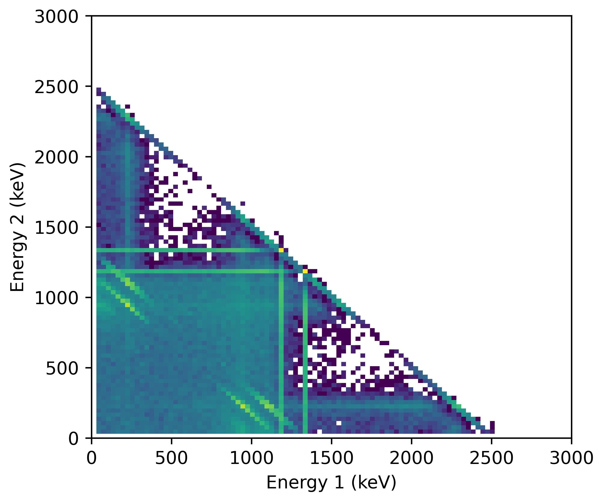

# 2024_Geant4_coincidence_detectors_test
Testing a method for simulating coincidence spectrometry in Geant4. 

Geant4 simulation of two Ge detectors facing each other with a Co-60 in the middle. 

Only the coincident detections are kept. Results are in the direcotry called images. 

Example of results: 

Winter 2024
